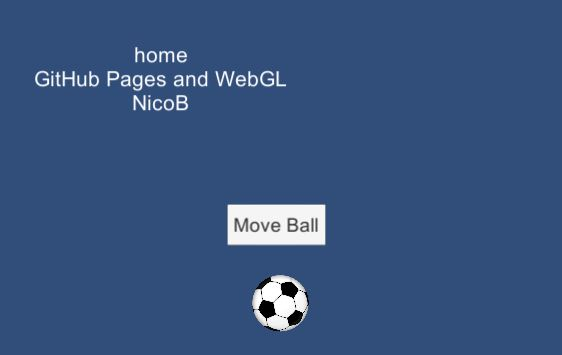
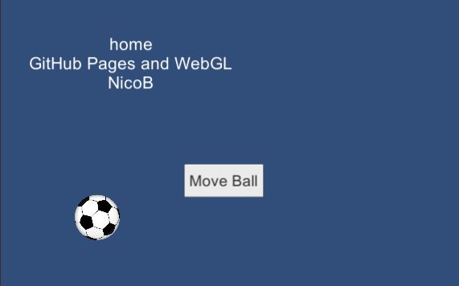

# home-WebGL-movingBall-cs-NicoB

### Project description: 
This project has a screen (960 x 600) in which there is a infotext, a button and a picture of a ball.
If you press the button the ball will change it's position always (V2) in one out of four (at the beginning) or three
(after pressing the button one time) possible possitions.

* The game is available under: https://3ahmnm-htlsbg.github.io/home-WebGL-movingBall-cs-NicoB/

### Development platform: 
* Windows 10; 
* Unity Version: 2019.1.14f1; 
* MonoDevelop v5.9.6;
* Scripting Runtime Version: 4.X;

### Target platform: 
WebGL 960x600 

### Visuals: 
#### Game Start

#### Button pressed

### Necessary setup/execution steps: 
WebGL has to be installed.

### Third party material: 
Ball: https://upload.wikimedia.org/wikipedia/commons/thumb/4/4f/Soccer_ball_animated.svg/768px-Soccer_ball_animated.svg.png

### Project state: 
100%

### Limitations: 
None

### Lessons Learned: 
* Generate and use random numbers
* Use a script in combination with a button
* Build for the WebGL platform
* Publish a WebGL project on GitHub Pages via folder docs

Copyright by NicoB
